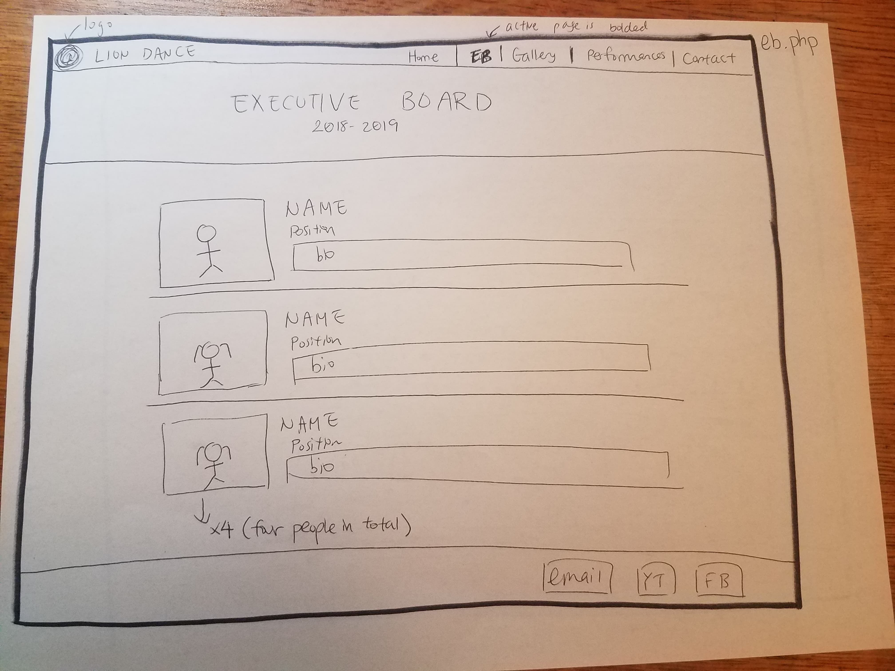
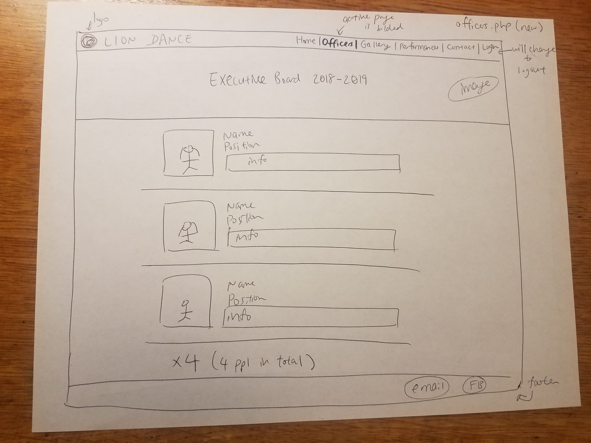

# Project 4: Design Journey

Your Team Name: Navy Horse

**All images must be visible in Markdown Preview. No credit will be provided for images in your repository that are not properly linked in Markdown. Assume all file paths are case sensitive!**


## Client Description

[Tell us about your client. Who is your client? What kind of website do they want? What are their key goals?]

Our client is Cornell Lion Dance, a group on campus that performs lion dance, a traditional Chinese dance. They want a website that explains who they are and what they do, and display images of their performances. Their goal is to promote lion dance and tell people more about the club.

## Meeting Notes

[By this point, you have met once with your client to discuss all their requirements. Include your notes from the meeting, an email they sent you, or whatever you used to keep track of what was discussed at the meeting. Include these artifacts here.]

*Meeting Notes 4/13/19*


*Information Sent by Client*
The client sent a google document including information that will be included in the website.


## Purpose & Content

The purpose of the website is to promote lion dance at Cornell campus and in the greater Ithaca area. There will be information explaining what Lion Dance is, what they do, images of performances, list of events they perform at, and contact information for anyone interested or for people who want to see them perform.

## Target Audience(s)

- The audiences for this website are people who are curious about Lion Dance and want to learn more and people who would like to see their performances. These people should all be adept with websites and the internet.
- The first audience (people who want to learn more) will look at the club's information, description of lion dance, image gallery of lion dance, and the club members.
- The second audience (people who want to watch them perform) will look at the image gallery for lion dance and check out the past events/future events list to see when their next performance is going to be.

## Client Requirements & Target Audiences' Needs

[Collect your client's needs and wants for the website. Come up with several appropriate design ideas on how those needs may be met. In the **Rationale** field, justify your ideas and add any additional comments you have. There is no specific number of needs required for this, but you need enough to do the job.]

- Client Requirement
  - **Requirement or Need**
    - Client wants the website to provide a general introduction to the club
  - **Design Ideas and Choices**
    - Create separate webpages including: basic explanation of what the club does and what lion dance is, when the club meets, an introduction to executive board members, an image gallery page, and a video gallery page
  - **Rationale**
    - Create multiple pages, each with distinct purposes, in order to better inform the target audiences about the club

- Client Requirement
  - **Requirement or Need**
    - Client wants the website to be one of several ways to view online what the club is up to
  - **Design Ideas and Choices**
    - Have a footer on each page that contains links to the club's social media profiles and email
  - **Rationale**
    - Links to social media and email on each page will lead viewers to additional information about the club and help viewers follow the club more closely, and allow viewers to directly contact the club

- Client Requirement
  - **Requirement or Need**
    - Client wants the website to display dates of performances
  - **Design Ideas and Choices**
    - Create a webpage with a calendar of events to show when the club is performing
  - **Rationale**
    - This lets the audiences know when to see club performances or activities

- Client Requirement
  - **Requirement or Need**
    - Client wants to add images to a gallery of performances over time
  - **Design Ideas and Choices**
    - Enable a login feature and a form when logged in to allow users to add images to the gallery
  - **Rationale**
    - This allows only people in the club to securely add images to the gallery with a simple interactive process

- Target Audience Need
  - **Requirement or Need**
    - Audience may want to request a performance by the club
  - **Design Ideas and Choices**
    - Include a page with a form to allow viewers to request a performance
  - **Rationale**
    - This allows users a simple way to communicate with the club about performance requests

## Initial Design

- Home Page


-EB Page


- Gallery Page


- Specific Image Page


- Performances Page


- Contact Page


## Information Architecture, Content, and Navigation

**Navigation**
  - Header: contains navbar with links to each of these pages
  - Index homepage
    - Introduction to club
    - What is Lion Dance?
  - Club Officers
    - Photos and bios of all club officers
    - Upload new officer form (only for logged in admin user)
  - Gallery
    - Image gallery
    - Upload pictures form (only for logged in admin user)
  - Performances
    - Calendar displaying all past and future performances
    - Mini-gallery displaying photos from recent performances
    - Add photo from gallery to mini-gallery form (only for logged in admin user)
  - Contact
    - Request a performance information
  - Login/Logout (accessible through header)
  - Footer

**Content**
  - *Introdution to Club*: provided by the club
    - *What is Lion Dance?*: provided by the club, description/explanation of lion dance
  - *Club EB*: image gallery/list of EB members
    - 4 EB members in total, include photo, name, year, and bio
  - *Image gallery*: images and captions provided by the club
  - *Login/logout*: log in and log out function so members of the club can delete and upload new photos for the image gallery
  - *Upload gallery pictures form*: only appears when someone is logged in, this allows admins to upload new pictures and captions into the image gallery
  - *Upload officer pictures form*: only appears when someone is logged in, this allows admins to upload new pictures and bios for officers
  - *Schedule of performances*: provided by the club, outline future performances (time, place, event), embed the Google calendar
  - *Recent performances*: show photos and descriptions of recent performances, in a select number of photos taken from the main gallery
  - *Request a Performance Info*: provided by the club, directions on how to request a performance
  - *Meeting info*: information about the club meetings, place, time
  - *Contact info*: email info so people can contact the club

**Process**
- Card Sorting


- Explanation of Content Organization and Navigation:
  - Much of the navigation was determined by the club and what they would like to see. The content was split up into five pages with the content generally categorized by theme/topic.

## Interactivity

[What interactive features will your site have? What PHP elements will you include?]

[Also, describe how the interactivity connects with the needs of the clients/target audience.]

- Login/logout
  - Each member of the board will have their own account and these will be the only accounts that can log in successfully.
  - This allows members of the executive board to exclusive ease to modify various parts of the site (gallery, officers, recent performances) as necessary. It lets all others users focus on the content itself.
- Once logged in, members will be able to upload and delete various new images
  - Image gallery + gallery upload form + gallery delete buttons: Allows logged in users to add and delete images and captions from the gallery. Makes the gallery dynamic, allowing officers to change content every so often and giving all other users new content.
  - Officers page + officers upload form + officers delete buttons: Allows logged in users to add and delete photos and descriptions of officers from the officers page. Lets officers give up-to-date information about the club as time passes.
  - Recent performances mini-gallery section of gallery page contains a small selection of photos taken from the main gallery, to showcase the club's recent performances. Logged in users can add photos to this mini-gallery and choose the event the photo is taken from. This allows multiple photos to be displayed for one performance event. Logged in users may also delete images from this mini-gallery. Gives those interested in Lion Dance a quick taste of what they might get from a performance.

## Work Distribution

[Describe how each of your responsibilities will be distributed among your group members.]

[Set internal deadlines. Determine your internal dependencies. Whose task needs to be completed first in order for another person's task to be relevant? Be specific in your task descriptions so that everyone knows what needs to be done and can track the progress effectively. Consider how much time will be needed to review and integrate each other's work. Most of all, make sure that tasks are balanced across the team.]

The first thing to be implemented will be the rough html and css of our site. We want the html and css to be started first for a couple of reasons. First, we want to have a rough design and aesthetic of the site to show to our client for feedback. While our client knows what they want the website to do, the actualization of our design may look different from what they expect from our discussions with them; or they may change their mind upon seeing the website. The first steps of the website will be implementing html and css to match our designs (see above). Afterwards, we will collectively begin work on the php.

In order to prevent dependancies on members, we will have members work claim and work on individual pieces of the website. We will maintain a list of tasks to be completed by the next milestone. Team members will claim and work on a given task until it's completion. As per our team contract, team members will have to self-judge how much work a task is relative to the entirety of the project for that milestone. Upon uploading the task, the other members will be expected to view and test their work in order to ensure that everything works. Bugfixing will be on the person who initially coded the component.

## Additional Comments

[If you feel like you haven't fully explained your design choices, or if you want to explain some other functions in your site (such as special design decisions that might not meet the final project requirements), you can use this space to justify your design choices or ask other questions about the project and process.]


--- <!-- ^^^ Milestone 1; vvv Milestone 2 -->

## Client Feedback


Potential Color Palette: https://coolors.co/fdffff-fff06b-d02b2d-1e1f1e-291711

## Iterated Design

[Improve your design based on the feedback you received from your client.]

- Login as a whole another form that is included in the navigation
- When you are logged in, the "log in" link in the nav is replaced with "log out" so you can log out.
- Performance request form and directions will be included in "Contacts"
- Revised image gallery: once image is clicked, it will appear as an overlay above the gallery (not in a new webpage).
- Edited some information; "meetings" to "practices" (move to index.php)
- Colors: red/white/yellow


## Evaluate your Design

[Use the GenderMag method to evaluate your wireframes.]

[Pick a persona that you believe will help you address the gender bias within your design.]

I've selected **Abby** as my persona.

I've selected my persona because... [Tell us why you picked your persona in 1-3 sentences. Your explanation should include why your persona will help you address gender-inclusiveness bugs in your design.]

The persona is the least tech savvy and the website should appeal to all users. Even the people who will be making edits to the website will not necessarily have a lot of software experiance.

### Tasks

[You will need to evaluate at least 2 tasks (known as scenarios in the GenderMag literature). List your tasks here. These tasks are the same as the task you learned in INFO/CS 1300.]

[For each task, list the ideal set of actions that you would like your users to take when working towards the task.]

Task 1: Schedule a performance for Cornell Lion Dance
Task 2: Log in and add an image

(For actions, see cognitive walkthrough below)


### Cognitive Walkthrough

[Perform a cognitive walkthrough using the GenderMag method for all of your Tasks. Use the GenderMag template in the <documents/gendermag-template.md> file.]
**Task name: Request a Lion dance performace.**

[Add as many subgoals as you needs]
**Subgoal # 1 Navigate to the page needed to request a Lion dance performace**
	(e.g., "# 1 : Select the section of the document you want to print")

  - Will Abby have formed this sub-goal as a step to their overall goal?
    - Yes, maybe or no: Yes
    - Why? There is no way to request a performance from the home screen. A person with a minimal amount of time searching the web would know about different paegs of a website, and would likely attempt to navigate to a page that could suit her goal

[Add as many actions as you need...]
**Action #1 Select performances.php link**

  - Will Abby know what to do at this step?
    - Yes, maybe or no: yes.
    - Why? (Especially consider Abby's Knowledge/Skills, Motivations/Strategies, Self-Efficacy and Tinkering.)
    Our navigation is well labeled enough such that there is not a logical other option. Assuming Abby would know to navigate to other pages, she would be able to select the correct page.

  - If Abby does the right thing, will she know that she did the right thing, and is making progress towards her goal?
    - Yes, maybe or no: yes
    - Why? (Especially consider Abby's Self-Efficacy and Attitude toward Risk.)
      In this scenario, the page she would pull up would immediately show the form to request a lion dance performance. She would be able to see it and would know that she navigated to the correct page.

  **Subgoal 2: Do the form request.**
  Will Abby have formed this sub-goal as a step in their overall goal?

  Will Abby know what to do
  - Maybe, the form is intended designed to clearly be a form, with expected information on the form. However, our sketch currently does not display this. To rememdy this issue, we will iterate on the sketch desgin.
   Will she know whe did the right thing
  Maybe, the form is intended to have good, standard feedback upon submission. However, our design does not current desplay form feedback.

[Add as many actions as you need...]
**Action #1 Input information to fill out the form**
	(e.g., "# 1 : Put the mouse at the beginning of the section you want to print")

  - Will Abby know what to do at this step?
    - Yes, maybe or no: Yes
    - Why?  Seems like a very basic, intuitive step to filling out an online form.

  - If Abby does the right thing, will she know that she did the right thing, and is making progress towards her goal?
    - Yes, maybe or no: Yes
    - Why? (Especially consider Abby's Self-Efficacy and Attitude toward Risk.)
      The form will hold information needed to fill out the form. Upon submission (the next step) she should recieve information about incorrectly filled out fields.

**Action #2 Submit the information**
  Will Abby know what to do
  - Yes, this step is also intuitive and common with most existing websites
  If Abby does the right thing, will she know she is making process towards her goal
  - Yes, there will be feedback letting her know that the form has been submitted.

**Task 2: Add an image to the gallery**
**Subgoal 1: Log in**
  Will Abby have formed this as a subgoal
  Maybe - the login form will appear directly on the home page. However it may not be intuitive that a user will be able to log in to edit certain pages and parts of the website. To remedy this, we plan on putting an explaination of what logging in gives users access to with the log in form.

  Action 1: log in
  - Will Abby know what to do at this step?
    - Yes, maybe or no: Yes
    - The site is designed to replicate common log in form structure

  - If Abby does the right thing, will she know that she did the right thing, and is making progress towards her goal?
    - Yes, maybe or no: Yes
    - Why? Again, The form will hold information needed to fill out the form. Upon submission (the next step) she should recieve information about incorrectly filled out fields.

  **Subgoal 2: add an image**
    Action 1: click the upload link
    - Yes
    The upload link will replace the login information. The website text will make it clear that that is the wya to upload information

    Action 2: select image to be added to gallery
    - Yes
    Assuming she knows what image she wants to add, the upload system should be as simple as selecting the image from her computer

    Action 3: Verify the image is in the gallery
    - Maybe
    There will be a sucessfully uploaded response, but she would have to naviagate to the gallery and search through all the images to be 100% sure, if she doesn't "trust" the website feedback.
*Source*: Margaret Burnett, Simone Stumpf, Laura Beckwith, and Anicia Peters, "The GenderMag Kit: How to Use the GenderMag Method to Find Inclusiveness Issues through a Gender Lens", http://gendermag.org, Feb. 1 2018 .


### Cognitive Walk-though Results

[Did you discover any issues with your design? What were they? How will you change your design to address the gender-inclusiveness bugs you discovered?]

[Your responses here should be **very** thorough and thoughtful.]
We discovered a few issues with our design. There are some things not shown in the design that we intend to implement such as form feedback which will indicate if some of the steps are successful. We didn't find any major holes in the desgin or in understanding how to do the given tasks. Many of our features are very standard and similar to most online sites and as a result should be both intiutive and gender inclusive. To cover any potential issues, we plan on putting redundancy on the site whenever possible or needed.


## Final Design

[Include sketches of your finalized design.]

[What changes did you make to your final design based on the results on your cognitive walkthrough?]

- Home Page


-Officers Page


- Gallery Page


- Contact Page


- Performances Page


- Login Page


## Database Schema

[Describe the structure of your database. You may use words or a picture. A bulleted list is probably the simplest way to do this.]

- users table
  - id (integer, not null, primary key, autoincrement)
  - username (text, not null, unique)
  - password (text, not null)
- sessions table
  - id, user_id, session
- images table
  - id (integer, not null, primary key, autoincrement)
  - file_name (text, not null)
  - file_extension (text, not null)
  - name (text, not null)
  - description (text, not null)
  - source (text)
- officer_images table
  - id (integer, not null, primary key, autoincrement)
  - file_name (text, not null)
  - file_extension (text, not null)
  - source (text)
- officers table
  - id (integer, not null, primary key, autoincrement)
  - name (text, not null)
  - position (text, not null)
  - biography (text, not null)
  - officer_image_id (foreign key to id column of officer_images)
- performances table
 - id (integer, not null, primary key, autoincrement)
 - performance (text, not null, unique)
-performances_images table
 - id (integer, not null, primary key, autoincrement)
 - image_id (integer, not null, foreign key to id column of images)
 - performance_id (integer, not null, foreign key to id column of performances)

## Database Queries

[Plan your database queries. You may use natural language, pseudocode, or SQL.]

Get all images:
  SELECT * FROM images

Get specific image for the slideshow on image click:
  SELECT * FROM images WHERE id=___

Get officers:
  SELECT * FROM officers

Get officer image for specific officer:
  SELECT officer_image_id FROM officers WHERE id=____
  SELECT * FROM officer_images WHERE officer_image_id=____

Find a user
  SELECT * FROM users WHERE id = :user_id;

Find a session from sessions
  SELECT * FROM sessions WHERE session_id = :session;

Get image from images that matches with performances
  SELECT performances.performance, performance_images.image_id, performance_images.performance_id, images.name, images.file_extension, FROM performances INNER JOIN performance_images ON performances.id = performance_images.performance_id INNER JOIN images ON performance_images.image_id = images.id

Insert image into gallery:
  INSERT INTO images (file_name, file_extension, name, description, source) VALUES (:file_name, :file_extension, :name, :description, :source)

Delete image from gallery:
  DELETE FROM images WHERE id = :image_id

Insert officer image:
  INSERT INTO officer_images (file_name, file_extension, source) VALUES (:file_name, :file_extension, :source)

Insert officer information:
  INSERT INTO officers (name, position, biography, officer_image_id) VALUES (:name, :position, :biography, :officer_image_id)

Delete an officer:
  DELETE from officers WHERE id = :officer_id

Delete an officer image:
  DELETE FROM officer_images WHERE id = :officer_image_id

## PHP File Structure

[List the PHP files you will have. You will probably want to do this with a bulleted list.]

* index.php - main page.
* gallery.php - image gallery
* contact.php - form to get in touch with lion dance
* officers.php - images and descriptions of eboard members
* performances.php - embedded google calender with events, display mini-gallery with recent performances
* login.php - form to log in
* logout.php - display page after logout
* includes/init.php - stuff that useful for every web page.
* includes/header.php - navigation, title of page
* includes/footer.php - links to other social media for Lion dance
* includes/slideshow.js - javascript for slideshow interactivity in gallery


## Pseudocode

[For each PHP file, plan out your pseudocode. You probably want a subheading for each file.]

### index.php

```
include init.php
include header.php
give basic information about Lion Dance
include footer.php
```

### gallery.php

```
include init.php
include header.php
if valid post request sent to add photo:
  add photo to uploads/gallery/
  add photo info to database
otherwise, if valid post request sent to delete photo:
  unlink photo from uploads/gallery/
  delete photo info from database
retrieve all image info from database
for each image in the images table:
  print out all images from database
if logged in:
  display delete photo buttons
  display add to gallery form
include footer.php
```

### officers.php

```
include init.php
include header.php
if valid post request sent to add officer:
  add officer photo to uploads/officers/
  add officer info to database
otherwise, if valid post request sent to delete officer:
  unlink photo from uploads/officers/
  delete officer info from database
retrieve all image info from database
for each image in the images table:
  print out all officer images and info
if logged in:
  display delete officer buttons
  display add officer form
include footer.php
```

### contact.php

```
include init.php
include header.php
If a post request to contact.php was made:
  If one or more required inputs are blank:
    Inform user of error
    Display form
  Otherwise
    Send performance request to Lion Dance email
    Display confirmation of performance request
Otherwise
  Display form
include footer.php
```

### performances.php

```
include init.php
include header.php
show Google calendar with events
retrieve recent performances from db
show recent performances
if logged in
  show buttons to remove photos from recent performances section
  show form to add photos to recent performances section
include footer.php
```

### login.php

```
include init.php
include header.php
If a post request was sent to login.php
  If user is logged in then
    Show login confirmation message
    Add session cookie
  Otherwise
    Print out error message
    Display login form
Otherwise
  Display login form
include footer.php
```

### includes/init.php

```
open or initialize database (given)
If an unexpired session cookie exists
  Renew session cookie for one more hour
  Set current user to the user with that session cookie
  login/logout code
  cookie timer code
  find user fnct - helper
  find session - helper
  session login - check if current user exists, check if the cookie session is still active, if both are true keep user logged in and reset session.
  is_user_logged_in() - check if current user exists, return true. otherwise, return false
```

### includes/header.php

```
Display navigation links
If current user is set
  Display logout button
Otherwise
  Display link to login page
Display different css for current page
```

### includes/footer.php

```
Display social media links
```

## Additional Comments

[Add any additional comments you have here.]


--- <!-- ^^^ Milestone 2; vvv Milestone 3 -->

## Issues & Challenges

[Tell us about any issues or challenges you faced while trying to complete milestone 3. Bullet points preferred.]
- Minor problems syncing/operating in github
- Some components took long than expected
- We're planning to meet to fully realize css/styles
- Login doesn't work for just one member of our gorup


--- <!-- ^^^ Milestone 3; vvv FINAL SUBMISSION-->

## Final Notes to the Clients

[Include any other information that your client needs to know about your final website design. For example, what client wants or needs were unable to be realized in your final product? Why were you unable to meet those wants/needs?]
  As per your request, the only login username is liondance and the password is kingofthejungle. Admin only allows you to add and remove images in the gallery and officers and add a new performance to the recent performances gallery. We implemented the design as per the feedback you gave us and we hope you like the overall design as much as we do.


## Final Notes to the Graders

[1. Give us three specific strengths of your site that sets it apart from the previous website of the client (if applicable) and/or from other websites. Think of this as your chance to argue for the things you did really well.]
  We think we did a good job with the overall design. We were careful with our color scheme to match Cornell Lion Dance's without making it the focus of the site. Even though the members of our team aren't part of lion dance, We prioritized making the site look like it was part of the club, and were sucessful.

  Our slideshow was done very cleanly. The enlarging and darkening function looks clean and professional, and making the images buttons is intuitive.

  Our implementation of admin forms to add and remove images was something that our client wanted and I think we implemented well. Even though it wouldn't be visable to non-admins, I think when the form appears on the site it is well integrated and looks like it belongs.

1. Most clubs on campus have relatively simple websites that are hard coded, so whenever the club wants to update the site, they need to change things around and need a webmaster for this. However, our site is dynamic and the club members can easily update the site themselves.

2. Another strength of the website is its interactivity. Members of the club have a good amount of control over what gets displayed on each page.

3. The site makes it easy for the club to handle performance requests. Any time somebody fills out the form to request a performance, the information from the form is emailed directly to them.

[2. Tell us about things that don't work, what you wanted to implement, or what you would do if you keep working with the client in the future. Give justifications.]
If we had more time, we would like to have implemented a home-made calendar built with html and CSS. A Google Calendar would suffice (but we cannot embed it into the website for the project). However, Google Calendars are also complex and sometimes have information that the club may not want to share (such as information that is only for club members like meeting dates). A built-in calendar into the website that the club can upload new events would be optimal. Due to the time constraints of this project however, we were unable to implement this calendar during this length of time. Given more time, we'd also implement the ability to move images around the gallery and change the ordering of officers, just to give the club a bit more control as to how the content is displayed on the page.

  We would have implemented in a homemade working calendar, given more time. For the client version, we're planning on embediing a google calendar, but it would have been nice to give them something very custom. As of now, an image placeholding is on our site.

  Overall though, the client wanted a relatively simple website and there was not additional functionality they requested that we could not implement.

[3. Tell us anything else you need us to know for when we're looking at the project.]
